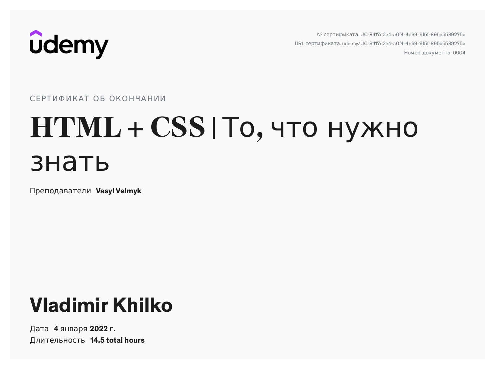
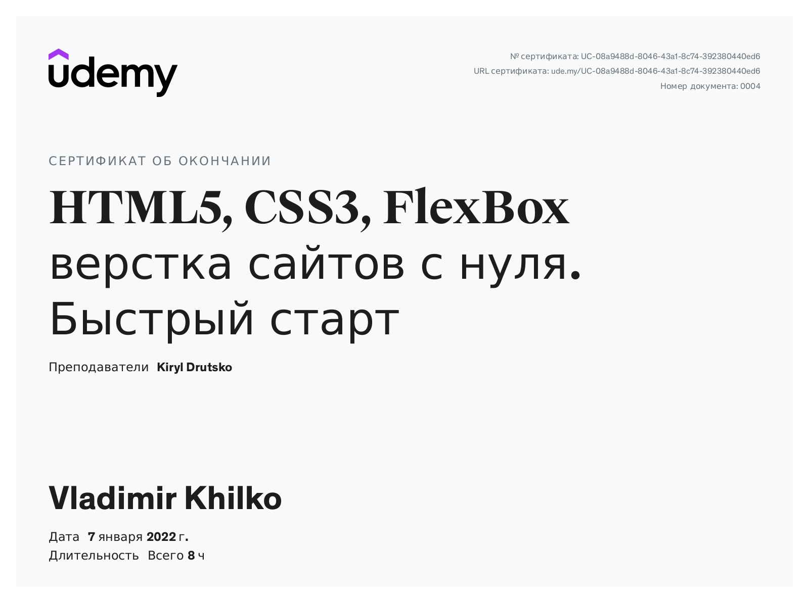
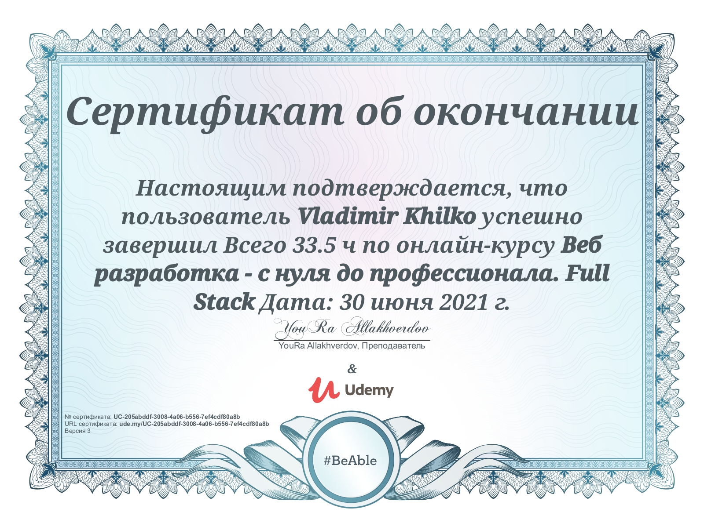
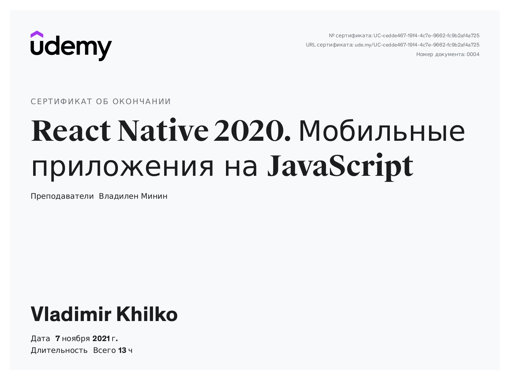

# **Vladimir Khilko**
***


## *__My contacts__*
----
* **Email:**   vladimirhilko@gmail.com
* **Phone:**   +375 44 7933766
* **Discord:** VladimirKhilko(@UladzimirKhilko)
***
***

## *__About me__*
***
At 53, I decided to try my hand at frontend development. I have been taking various online courses on Udemy for over a year. Since November 2021, I have been working on a small project as a developer. I really enjoy the application development process. I love getting new knowledge. I take the learning process very seriously. Taking these courses is a challenge to yourself...
***
***
## *__Skills__*
***
* HTML
* CSS (SASS/SCSS, Bootstrap)
* JS (Fundamentals, OOP, ES6+, DOM, JSON)
* React JS, Redux (have development experience)
* Git/GitHub
* Figma, Photoshop (for web development)
* VSCode, Sublime
***
***
## *__Code examples__*
***
``` javascript
function filterArray(array, callback) {
  const newArray = [];
  
  for (let i = 0; i < array.length; i += 1) {
    if (callback(array[i])) newArray.push(array[i]);
  }
  return newArray;
}
const numbers = [1, 2, 3, 4, 5];

function isOdd(num) {
    return num % 2 !== 0; 
}
function isEven(num) {
   return num % 2 === 0;
}

filterArray(numbers, isOdd);
filterArray(numbers, isEven);

//Проверка
console.log(filterArray(numbers, isEven)); // [2, 4]
console.log(filterArray(numbers, isOdd)); //[1, 3, 5]
```
***
***
## *__Education__*
***
* **Udemy**
    * HTML + CSS
    
    * HTML5, CSS3, FlexBox
    
    * Full Stack 
    
    * JavaScript + React
    
    * React 
    
    * React Native 2020
    
    * Fundamentals JavaScript (in process)

***
***
## *__Languages__*
***

  * **Russian** - native speaker.
  * **English** - A2 (Elementary)

